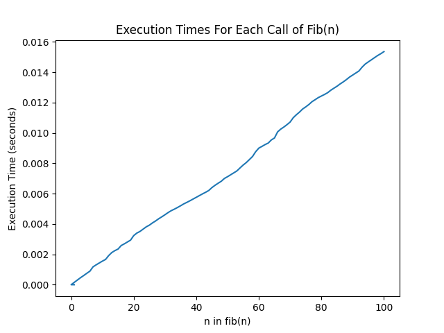

# Assignment 1
## Echo
A program that imitates a real-world echo. The method <code>echo()</code> has two input parameters: <code>text</code> is a string which represents what you yelled at a mountain; <code>repetitions</code> is an integer which represents the number of times that the mountain echoes your voice. The method <code>echo()</code> returns a string which represents the echoed sound with fading effect. A couple of example outputs are as follows.
```
$ python echo.py
   Yell something at a mountain: Helloooo
   ooo
   oo
   o
   .
$ python echo.py
   Yell something at a mountain: echo 123
   123
   23
   3
   .
```
## Fibonacci
A program that computes the <code>n<sup>th</sup></code> fibonacci number in the fibonacci sequence recursively through the function <code>fib(n)</code>. The execution of each call is timed with the decorator <code>@timer</code>. The <code>@timer</code> decorator prints the execution time of each call as follows.
```
Finished in 0.0000s: fib(1) -> 1
Finished in 0.0000s: fib(0) -> 0
Finished in 0.0005s: fib(2) -> 1
Finished in 0.0006s: fib(3) -> 2
...
Finished in 0.0194s: fib(98) -> 135301852344706746049
Finished in 0.0198s: fib(99) -> 218922995834555169026
Finished in 0.0203s: fib(100) -> 354224848179261915075
```
I collected the times for each execution of <code>fib(n)</code> and plotted it using <code>matplotlib</code>. The results are below.
